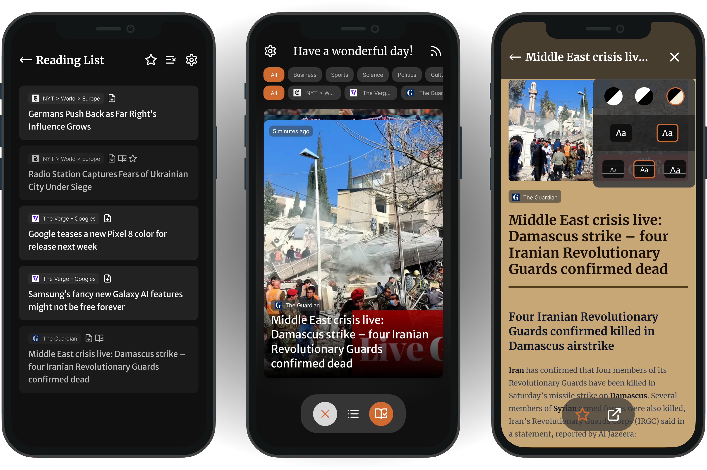

# RSSwipe


RSSwipe is a RSS reader that allows you to find your next article just like you would find your next date. Swipe left to skip, swipe right to save for later. It's that simple. 

This repo contains the code for the frontend, a progressive web app written in Vuejs, and the backend, an expressjs server with a prisma database exposing a REST api.

RSSwipe was originally developed as a project for a web engineering course at the University of Applied Sciences Lübeck. We took a lot of inspiration from [Fox RSS](https://github.com/16arpi/Fox-RSS) - a similar app for swiping articles but it runs natively on Android and has no backend.



## Features

### 👆 Swipe

You can swipe through articles like you would on a dating app. Swipe left to skip, swipe right to save for later.

### 🛜 Sync Across Devices

Your account is synced across all your devices. You can use RSSwipe on your phone, tablet and computer.

### 📱 Progessive Web App

RSSwipe is a progressive web app. You can install it on your phone or computer and use it like a native app. Articles in your readinglist are available offline.

### 📰 RSS, Atom and RDF Feeds

You can add RSS, Atom and RDF feeds to your account. They are automatically updated on the server every few minutes.

### 📑 Readinglist

You can save articles for later in your readinglist. The readinglist is synced across all your devices. To keep it clean, you can set a time after which articles are automatically removed.

### 🧾 Read In App

When you find an article you want to read, you can open it in the app. The article is displayed in a clean and readable format powered by [Mozillas Readability](https://github.com/mozilla/readability). 
You can set per feed if you want to open the article in the app or in the browser - this way you can still support your favorite content creators.

### 😢 Swipe Limit

You swipe too much? No problem, you can set a swipe limit per day. When you reach the limit, you can still read articles in your readinglist.

## Usage & Deployment

The recommended way to deploy RSSwipe is to use the provided docker-compose file. 

To deploy the app, you need to have docker and docker-compose installed on your machine.

Get the `docker-compose.yml` file in the docker directory of this repository:

```sh
wget https://raw.githubusercontent.com/Importantus/RSSwipe/main/docker/docker-compose.yml
```

Create an `.env` file in the same directory as the docker-compose file and copy the content of the `.env.prod` file into it.

```sh
wget -O .env https://raw.githubusercontent.com/Importantus/RSSwipe/main/.env.prod
```

Edit the `.env` file and set the values for the environment variables.

Start the app (this may take a short while):

```sh
docker compose up
```

The app is now running on port 80 or the custom `FRONTEND_FORWARD_PORT` you set in the `.env` file. 

To run the app in the background, add the `-d` flag:

```sh
docker compose up -d
```

To update the app, pull the latest changes from the repository and restart the app:

```sh
docker compose pull && docker compose up -d
```

## Local Setup

Clone the repo:

```sh
git clone https://github.com/Importantus/RSSwipe.git
```

Create an .env file in the root directory of the project and copy the content of the .env.local file into it.
Do the same for the .env file in the /backend/prisma directory.

Start the app:

```sh
cd RSSwipe/
docker compose up
```

Run migrations:

```sh
cd backend/
npx prisma migrate deploy
```

Generate the prisma client:

```sh
npx prisma generate
```

### How to make changes to the database

Make changes to the schema.prisma file

Create a migration:

```sh
npx prisma migrate dev --name <name of migration>
```

### Troubleshooting

If there are problems with the database, try to delete the docker volumes and restart the app:

```sh
docker compose down -v
docker compose up --build
```